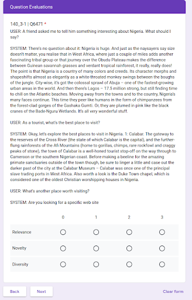

# CAsT-ReGIn

CAsT-ReGIn is a resource we created to facilitate system response and clarification question evaluation in the [fourth edition of the TREC Conversational Assistance Track](https://www.treccast.ai/) (CAsT Y4). We collected these annotations on the responses and questions submitted by participants of the track.

## MI Question Subtask Resources and Evaluation

We crowdsourced relevance, diversity, and novelty judgments for the top one clarification question returned for each turn across all submitted runs for the mixed initiative (MI) sub task. In crowd-sourcing these judgements, we created the following key resources:

### Key resources: 

- [MI Question Pool](clarifying_question_evaluation/question_pool_depth_1.pool.tsv): All clarification questions evaluated for each turn. This consists of the top one question for each turn across all runs
- [Updated MI Question Bank](clarifying_question_evaluation/question_bank.json): All questions (from the initial question bank and generated by participant systems) used for the sub task and their IDs
- MI Run Files: Submitted runs converted to TREC run files for ease of evaluation (Provided to participants separately)
- [MI QRel Files](clarifying_question_evaluation/qrels): Aggregated judgements (relevance, diversity, novelty) for all questions in the MI Question Pool. These are also filtered for turns with one or more judgements greater than or equal to 2.

### Description of draft pool file
The draft pool file is a “TREC run”- style file that forms the basis of the MI question pool. Each line in the pool contains a turn ID and a question to be evaluated for that turn. We refer to the pool as a draft because we intend to expand it with more questions.

The draft pool file is formatted as follows:

```
132_1-1 Q0  Q0821   1   0.0 dummytag
132_1-1 Q0  Q1856   1   0.0 dummytag
132_1-1 Q0  Q4759   1   0.0 dummytag
132_1-1 Q0  Q4964   1   0.0 dummytag
132_1-1 Q0  Q5318   1   0.0 dummytag
132_1-1 Q0  Q5919   1   0.0 dummytag
132_1-1 Q0  Q6070   1   0.0 dummytag
132_1-1 Q0  Q6274   1   0.0 dummytag
132_1-3 Q0  Q1856   1   0.0 dummytag
```

The question ID to question mapping can be found in the Updated MI Question Bank.

### Judgment Criteria and Scale

We asked crowd workers to assess each question against the following rubric:

Relevance: Does the question (logically) follow on from previous utterances?

    0. Not Relevant - doesn't follow on from the previous utterances, seems to be completely random, to the current conversation, seems to be a completely different conversation.
    1 Partially Relevant - veering off topic, vaguely related, but too divergent from the conversation.
    2. Relevant - follows on, but it is not entirely clear why the question is being presented/asked
    3 Highly Relevant  - directly follows on and it is clear why the question is being presented/asked

Novelty: Does the question add new information to the conversation? 

    0. No - the question restates the question, asks a question for which the answer can already be determined from the conversation thus far, restates something already said.
    1. Somewhat, but no (non-relevant /nonsensical) - the question add something new, but it doesn’t make sense in the current conversation.
    2. Yes (but not useful) - adds something new, but is not helpful or interesting to the conversation
    3. Yes (adds to the conversation/interest) - adds something new to the conversation that could be interesting to follow up on, or presents paths that could be taken later in the conversation

Diversity: Does the question provide a number of options?

    0. None. Provides an answer without explicitly trying to provide new avenues for the user to inquire about.
    1. Offers binary choice. (did you mean…) yes/no or A and B
    2: Offers 3 or more: offers the user a number of choices on how to proceed
    3: Open ended. Asks a question that invites any number of responses/answers from the user.


###  Crowdsourcing and filtering process

We asked 5 to 10 crowdworkers to assess questions in the question pool for all turns in one topic. For each turn and clarification question pair, we provided workers with the “conversation so far” as context to make their judgments.



To eliminate low quality judgments, we found and assessed obvious low quality questions for each topic. We used these assessments as a filter to remove all judgements from workers who deviated from our judgement (i.e question should have been given a label of 0 for relevance but worker gave it a 3).

For example, for query _136_1-1_, we expect that the following question: _“Are you looking for a specific web site”_ will be judged as not relevant or partially relevant. If a worker rated this question as relevant or highly relevant, we would eliminate their judgements across the entire topic.

Based on these crowd-sourced judgements, we generated qrel files for each criteria that questions were judged against. We determined the final judgement for each question based on majority vote amongst crowd-workers (i.e mode). Where there was no clear majority, we based the final judgement on the average of all judgements given by the crowdworkers.


### Submission to run format process

We used Python code to convert all participant runs to TREC style run files, with question texts mapped to Question IDs per the MI Question Bank. Scores for each turn - question pair were gotten from the submitted json run file. Here’s an example of one of the baseline run files:

```
132_1-1    Q0    Q1856    1    7.498799800872803    bm25_baseline_mi_run
132_1-1    Q0    Q4324    2    6.7779998779296875    bm25_baseline_mi_run
132_1-1    Q0    Q3377    3    4.3618998527526855    bm25_baseline_mi_run
132_1-1    Q0    Q4509    4    4.248300075531006    bm25_baseline_mi_run
132_1-1    Q0    Q2668    5    4.0467000007629395    bm25_baseline_mi_run
```

### Evaluation details and discussion
We evaluated each submission’s TREC run file with trec_eval. We used a threshold of 2 (i.e -L2) and only the evaluated turns at the intersection of the qrel file and the submission (i.e -c). We did this for all turns, using a complete qrels file (all turns) and a reduced qrel file (just turns that require mixed initiative). 

Additional evaluation results will also look at the combination of relevance + novelty and diversity.  We encourage participants to use the judgments to analyze the behavior of outputs in greater depth. 


## System Response and Evaluation

For each submission to the main task, we crowdsourced relevance, naturalness, and conciseness judgments for the top one response across all turns.

Only the first response with at least one relevant piece of provenance (as judged by NIST assessors) and that occurred in the top 3 ranking were judged.

In crowd sourcing these judgements, we created the following key resources:

### Key resources: 
- [Response Pool](response_evaluation/response_pool_depth_1.pool): All responses evaluated for each turn. This consists of the top one response for each turn across all runs
- [Response Bank](response_evaluation/response_bank.json): All evaluated responses and their IDs
- Response Runs:  Submitted runs converted to TREC run files for ease of evaluation (Provided to participants separately)
- [Response QRels](response_evaluation/qrels): Aggregated judgements (relevance, conciseness, naturalness) for all questions in the Response Pool. These are filtered for turns that have one or more judgement greater than or equal to 2.

### Description of draft pool file
Same details as in MI sub task except that all response texts are mapped to IDs.

132_1-1    Q0    R00000    1    0.0    dummytag
132_1-1    Q0    R00263    1    0.0    dummytag
132_1-1    Q0    R00321    1    0.0    dummytag
132_1-1    Q0    R00395    1    0.0    dummytag
132_1-1    Q0    R00585    1    0.0    dummytag
132_1-1    Q0    R00711    1    0.0    dummytag


###  Judgment Criteria
We asked crowdworkers to evaluate each response on the following criteria:

Relevance: Does the SYSTEM response follow on from previous utterances?

    0. Not Relevant - doesn’t follow on from the previous utterances, seems to be completely random, to the current conversation, seems to be a completely different conversation.
    1 Partially Relevant - veering off topic, vaguely related, but too divergent from the conversation.
    2. Relevant - follows on, but it is not entirely clear why the response is being presented
    3.Highly Relevant  - directly follows on and it is clear why the response is being presented

Naturalness: Does the response sound human like?

    0. No - The response does not sound like something a human would say given the conversation
    1. Somewhat, but no - The response is a bit human like. the response somewhat understandable but a non-native speaker with low english skills would have said it
    2. Yes (but not completely) - The response is almost human like. The response is well-formed but is not natural
    3. Yes - The response is very human like and is something a native speaker would have said.

Conciseness: Does the response adequately follow on from the previous utterances in a concise manner?

    0. No. Response is too wordy or too short. Response may also contain lots of irrelevant content or no relevant information at all
    1. Somewhat, but no: response is a bit wordy and does not adequately address USER’s utterance (i.e the response is longer than needed)
    2: Yes (but not completely): response is brief but not comprehensive (i.e does not adequately address USER’s utterance/query or properly follow on from the conversation)
    3: Yes. Response is brief but comprehensive (the response was concise and to the point without too much/little other information)

### Crowdsourcing and Filtering Process

We followed the same approach used to crowdsource, filter and aggregate judgements for the MI sub task.

### Submission to run format process

Same process with MI run conversion process. However, run files only contain at most three responses per turn, and each response must have been grounded in at least one relevant piece of provenance (as judged by NIST assessors). 

Here’s an example from the baseline run:

```
132_1-1    Q0    R01432    1    1.0    BM25_T5_BART
132_1-5    Q0    R01584    1    1.0    BM25_T5_BART
132_2-1    Q0    R01585    1    1.0    BM25_T5_BART
132_2-7    Q0    R01586    1    1.0    BM25_T5_BART
132_2-11    Q0    R01432    1    1.0    BM25_T5_BART
```

### Evaluation details and Discussion

Same approach followed as for MI sub task, except that we did not consider any subset of turns.
